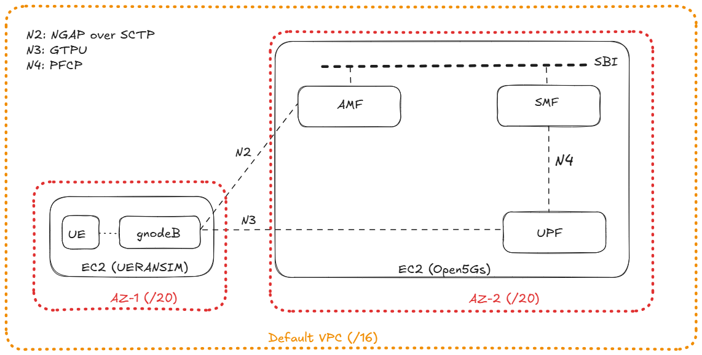
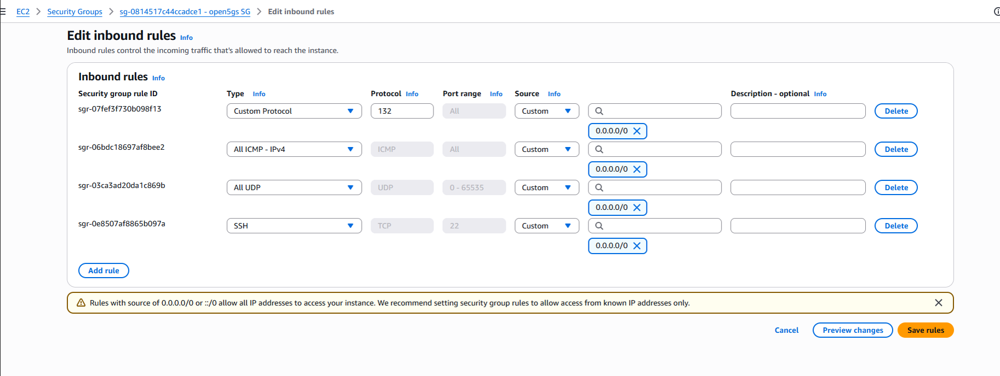
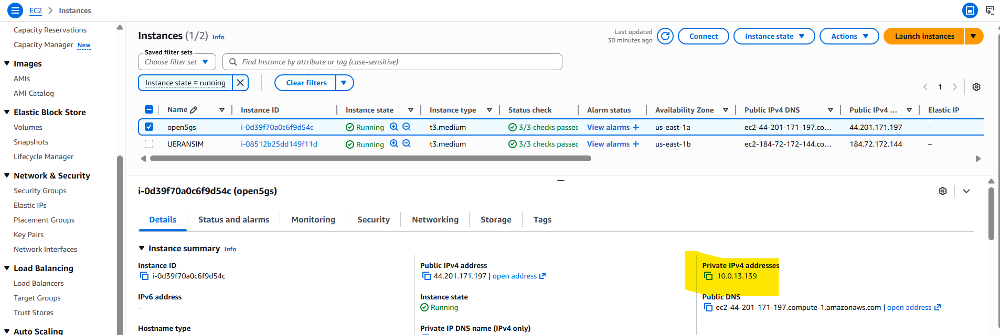
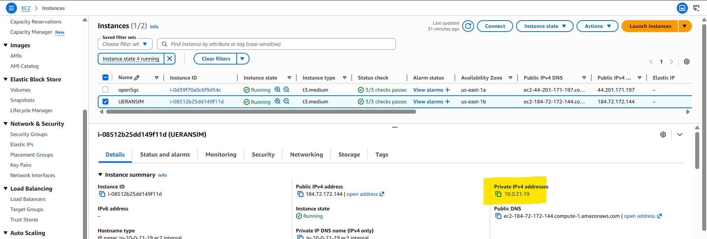

# **Lab 2 – Distributed Open5GS + UERANSIM on AWS (Two‑EC2 Architecture)**

~The pre‑configured AWS AMI for this lab is available to share. For details, see the About page.~

This lab extends the work from Lab 1, but introduces a major architectural change:  
instead of running both Open5GS and UERANSIM on a single EC2 instance, the system is now distributed across two EC2 instances, each in a separate Availability Zone.

The goal of Lab 2 was to validate that Open5GS and UERANSIM can operate across AWS infrastructure boundaries, with correct routing, SCTP/GTP‑U reachability, and proper N2/N3 interface binding.

<figure markdown="span">
  { width="600" }
  <figcaption>Lab 2 – Distributed AWS Architecture</figcaption>
</figure>

---

## **1. Architecture Overview**

Lab 2 uses two EC2 instances inside the same VPC:

### **EC2 #1 – UERANSIM**

- Runs gNodeB
- Runs UE
- Handles RRC, NGAP, and GTP‑U uplink/downlink
- Must reach AMF (N2) and UPF (N3) over private IPs

### **EC2 #2 – Open5GS Core**

- Runs AMF, SMF, UPF, NRF, SCP, UDM, UDR, AUSF
- UPF exposes GTP‑U (UDP/2152)
- AMF exposes NGAP (SCTP/38412)

Both instances remain inside the same VPC, so routing is automatic.  
However, AWS does not allow SCTP or GTP‑U by default, so Security Groups must be configured manually.

<figure markdown="span">
  { width="600" }
  <figcaption>Lab 2 – SG configuration</figcaption>
</figure>

---

## **2. Key Differences from Lab 1**

Lab 1 used a single EC2 instance, so all interfaces were loopback‑local or internal to the same machine.

Lab 2 introduces the following changes.

### **(A) Distributed N2 and N3 interfaces**

You must update the following in UERANSIM configs to use EC2 private IPs.

#### **N2 (NGAP over SCTP)**

<figure markdown="span">
  { width="600" }
  <figcaption>Lab 2 – Private IP address of AZ for Open5GS</figcaption>
</figure>

<figure markdown="span">
  { width="600" }
  <figcaption>Lab 2 – Private IP address of AZ for UERANSIM</figcaption>
</figure>
