# LAB 3 – Open5GS + UERANSIM + Splunk Integration

## 1. Booting the Server (AMI V04)
- Launch EC2 instance from **Open5GS AMI V04**
- Set timezone:
```bash
sudo timedatectl set-timezone Australia/Sydney
timedatectl
```


## 2. Initial Health Checks

- Verify Open5GS **MongoDB health**
- Verify **WebUI availability**
- Log in to the Open5GS WebUI
- Open required EC2 ports:

| Port | Purpose |
|------|---------|
| 8000 | Open5GS WebUI |
| 9999 | UERANSIM gNodeB |

## 3. Preparing Log Files

Observed around **3.65GB** of accumulated logs.  
Resetting all Open5GS logs for a clean session:

```bash
truncate -s 0 /var/local/log/open5gs/*.log
```

## 4. Bringing Up the First 8 Nodes

```bash
~/open5gs-lab.sh
sudo setcap cap_net_admin=eip /usr/local/bin/open5gs-upfd
bash ~/launch-upf.sh

tmux set -g mouse off
```

## 4. Bringing Up the Remaining 3 Nodes

```
bash ~/launch-open5gs.sh
```
## 5. Starting UERANSIM (UE + gNodeB)

```
bash ~/tmux-ueransim.sh
```

## 6. Modifying AMF Configuration & Restarting AMF

```
sudo nano /etc/open5gs/amf.yaml
/usr/local/bin/open5gs-amfd -c /etc/open5gs/amf.yaml | tee ~/open5gs-logs/AMF.log
```

## 7. Modifying gNodeB Configuration & Restarting gNodeB

```
sudo nano ~/UERANSIM/config/open5gs-gnb.yaml
~/UERANSIM/build/nr-gnb -c ~/UERANSIM/config/open5gs-gnb.yaml | tee ~/ueransim-logs/gNB.log
```

## 8. Modifying UE Configuration & Restarting UE

```
sudo nano ~/UERANSIM/config/open5gs-ue.yaml
sudo ~/UERANSIM/build/nr-ue -c ~/UERANSIM/config/open5gs-ue.yaml | tee ~/ueransim-logs/UE.log
```

## 9. Switching Off UE

```
cd ~/UERANSIM/build
./nr-cli imsi-999700000000001 -e "deregister switch-off"
```

## 10. Automated Attach/Detach Cycling

```
/home/ubuntu/ue-cycle.sh
```

## 11. Useful Monitoring Commands

```
./nr-cli UERANSIM-gnb-999-70-1 -e "ue-list"
./nr-cli UERANSIM-gnb-999-70-1 -e "ue-count"
./nr-cli UERANSIM-gnb-999-70-1 -e "status"
./nr-cli UERANSIM-gnb-999-70-1 -e "info"
./nr-cli UERANSIM-gnb-999-70-1 -e "amf-info"
./nr-cli --dump
```

## 12. Installing Splunk Enterprise

```
sudo su
cd /opt
wget -O splunk-10.0.0.deb "https://download.splunk.com/products/splunk/releases/10.0.0/linux/splunk-10.0.0-e8eb0c4654f8-linux-amd64.deb"
dpkg -i splunk-10.0.0.deb
apt-get install -f
/opt/splunk/bin/splunk start --accept-license
/opt/splunk/bin/splunk enable boot-start
```

## 13. Adding Open5GS Logs to Splunk


AMF Log Input, File: /var/local/log/open5gs/amf.log, Monitor: Continuously, Source Type: generic_single_line, App Context: search, Host: EC2 hostname, Index: default


## 14. Splunk Input Successfully Created

Splunk is now indexing Open5GS + UERANSIM logs and ready for:

Searching, Field extraction, Dashboard creation, KPI visualization


<figure markdown="span">
  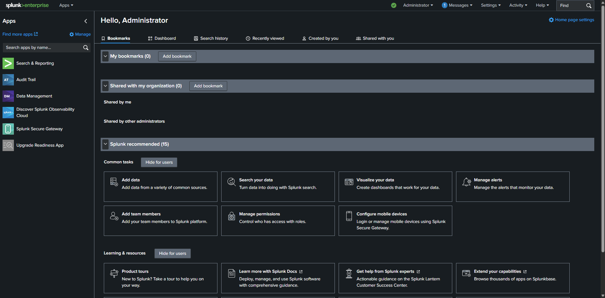{ width="600" }
  <figcaption>Splunk configuration</figcaption>
</figure>


<figure markdown="span">
  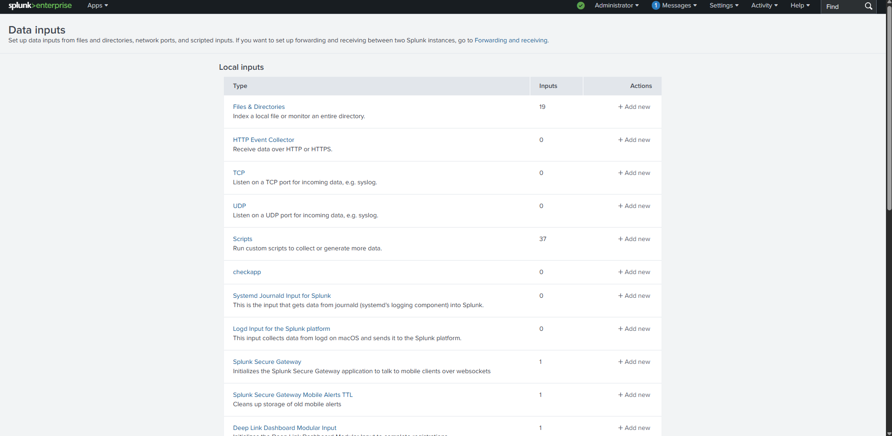{ width="600" }
  <figcaption>Splunk configuration</figcaption>
</figure>


<figure markdown="span">
  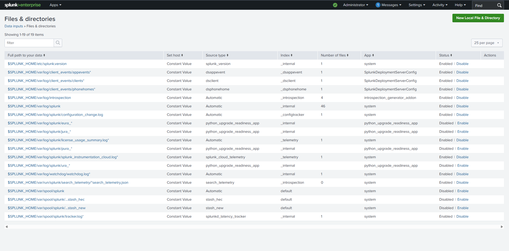{ width="600" }
  <figcaption>Splunk configuration</figcaption>
</figure>

<figure markdown="span">
  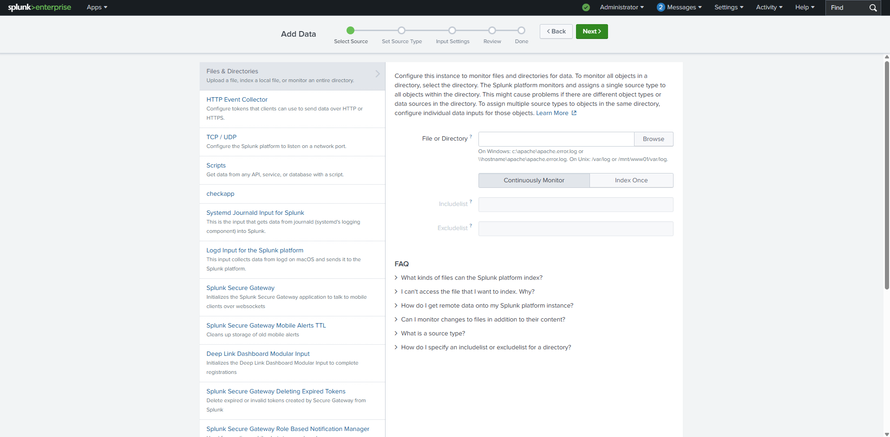{ width="600" }
  <figcaption>Splunk configuration</figcaption>
</figure>

<figure markdown="span">
  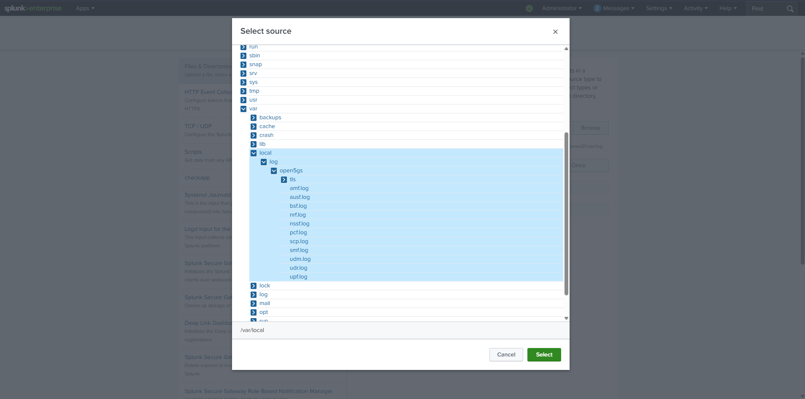{ width="600" }
  <figcaption>Splunk configuration</figcaption>
</figure>

<figure markdown="span">
  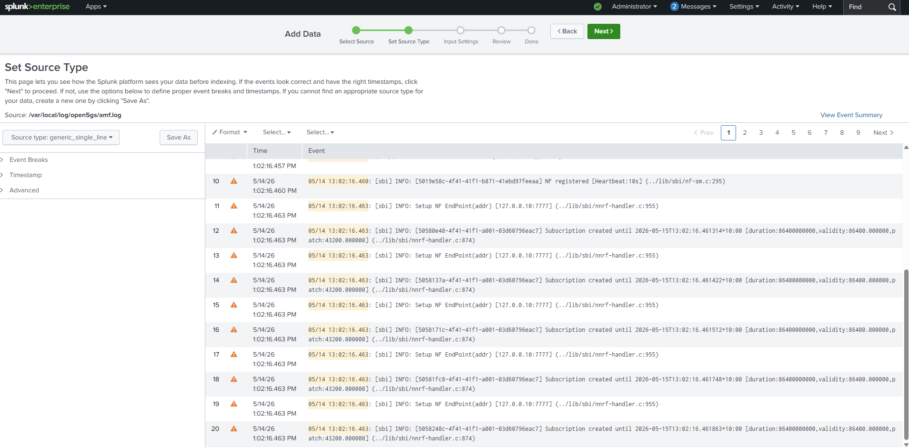{ width="600" }
  <figcaption>Splunk configuration</figcaption>
</figure>

<figure markdown="span">
  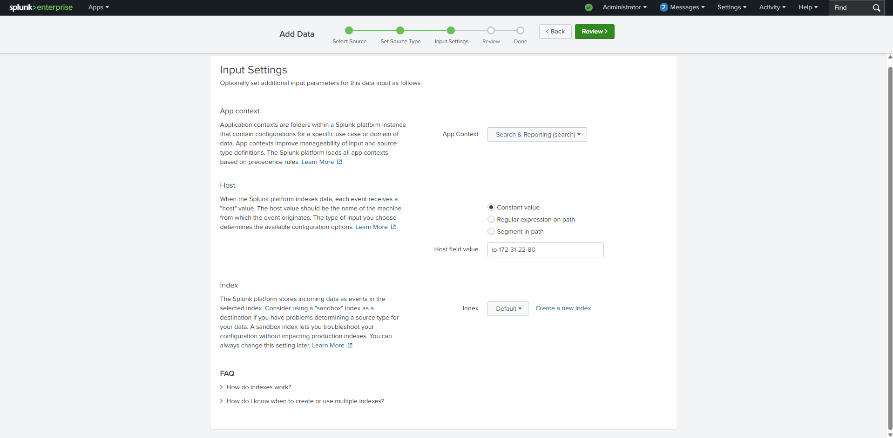{ width="600" }
  <figcaption>Splunk configuration</figcaption>
</figure>

<figure markdown="span">
  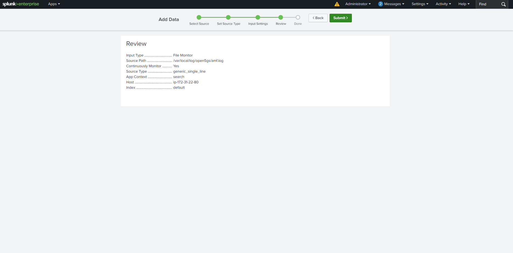{ width="600" }
  <figcaption>Splunk configuration</figcaption>
</figure>

<figure markdown="span">
  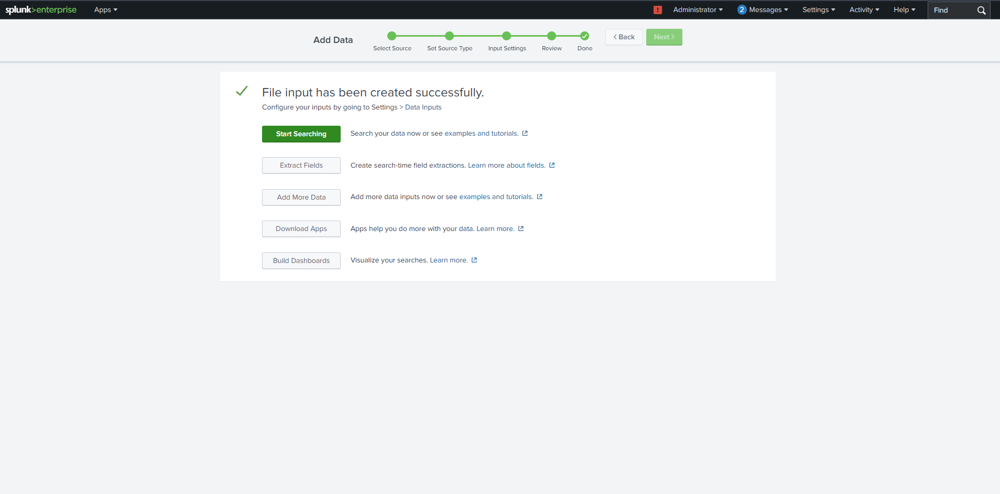{ width="600" }
  <figcaption>Splunk configuration</figcaption>
</figure>

<figure markdown="span">
  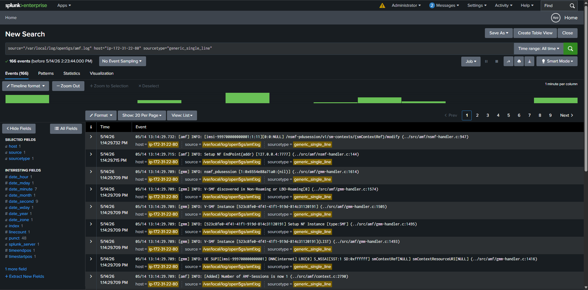{ width="600" }
  <figcaption>Splunk configuration</figcaption>
</figure>

<figure markdown="span">
  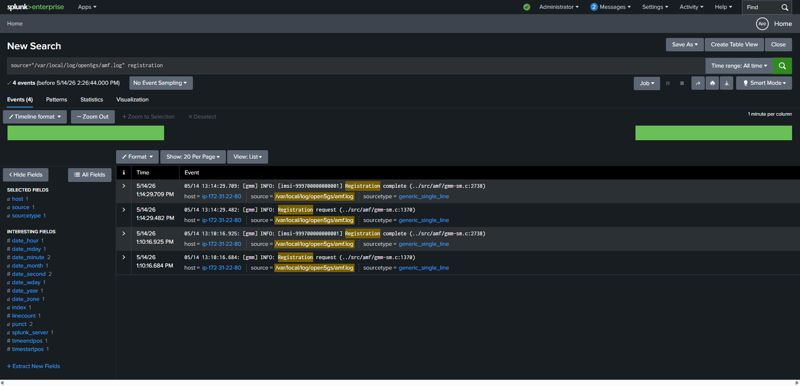{ width="600" }
  <figcaption>Splunk configuration</figcaption>
</figure>


