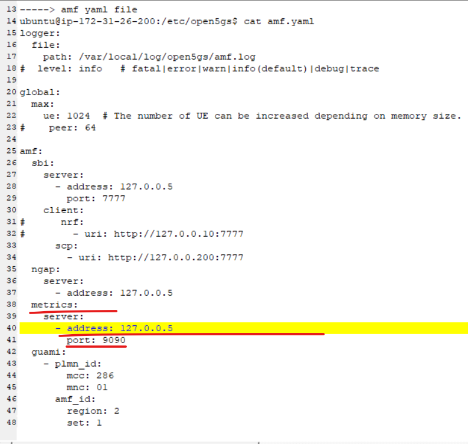
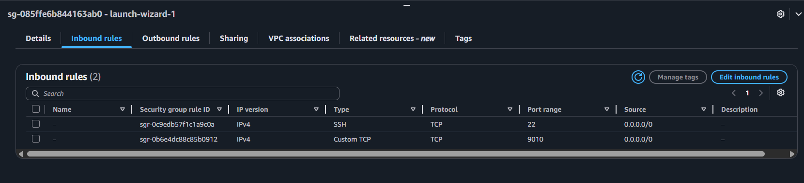
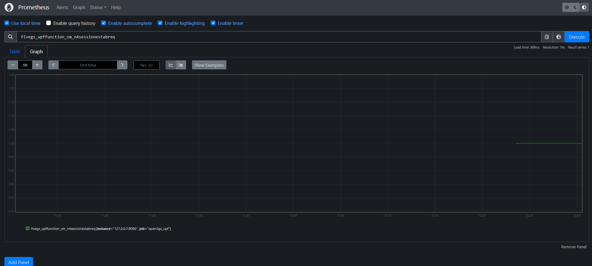
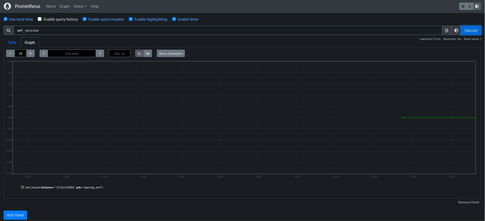
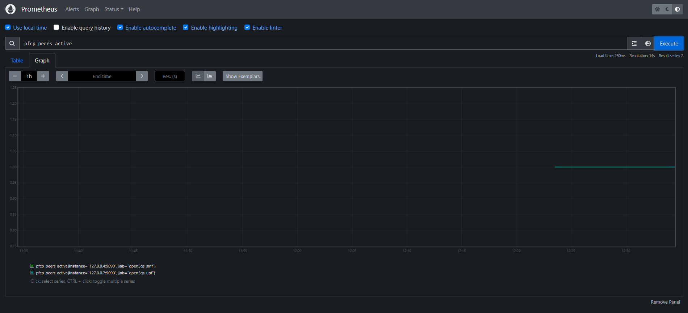
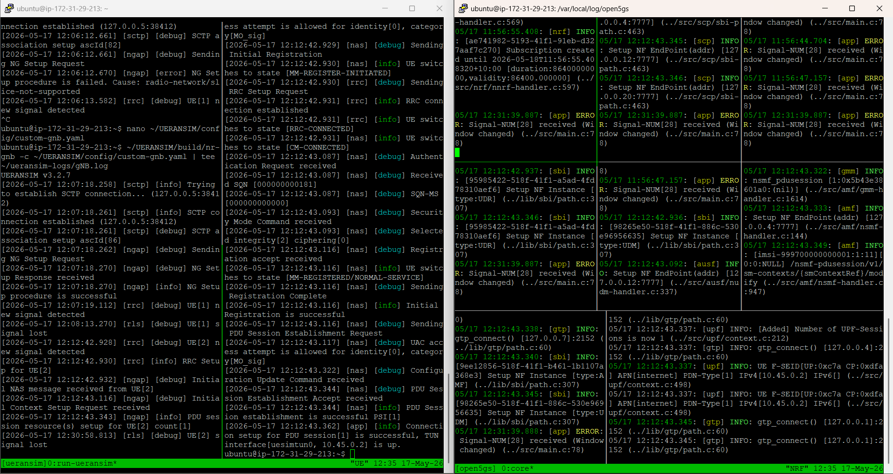

# LAB 4 – Open5GS + UERANSIM + Prometheus Integration

~The pre‑configured AWS AMI for this lab is available to share. For details, see the About page.~

This section covers how to install Prometheus on your EC2 instance and configure it to scrape metrics from the Open5GS AMF, SMF, and UPF network functions. Prometheus provides time‑series monitoring and is commonly used in 4G/5G labs to visualize NF performance, track KPIs, and integrate with Grafana dashboards.

## 1. Installing Prometheus

The following script installs Prometheus, creates the required system user, and prepares the directory structure.
Run the script on your EC2 instance:

```bash
cat <<'EOF' | sudo tee /tmp/install_prometheus.sh
#!/bin/bash
set -e

# Create user and directories
sudo useradd --no-create-home --shell /bin/false prometheus
sudo mkdir -p /etc/prometheus /var/lib/prometheus

# Download Prometheus
cd /tmp
curl -LO https://github.com/prometheus/prometheus/releases/download/v2.48.0/prometheus-2.48.0.linux-amd64.tar.gz
tar xvf prometheus-2.48.0.linux-amd64.tar.gz
cd prometheus-2.48.0.linux-amd64

# Move binaries
sudo cp prometheus promtool /usr/local/bin/
sudo cp -r consoles console_libraries /etc/prometheus/

# Set ownership
sudo chown -R prometheus:prometheus /etc/prometheus /var/lib/prometheus
EOF

bash /tmp/install_prometheus.sh
```

## 2. Prometheus Configuration for Open5GS

Prometheus scrapes metrics from Open5GS network functions using their built‑in metrics endpoints.
Create the Prometheus configuration file:

```bash
cat <<'EOF' | sudo tee /etc/prometheus/prometheus.yml
global:
  scrape_interval: 15s

scrape_configs:
  - job_name: 'open5gs_amf'
    static_configs:
      - targets: ['127.0.0.5:9090'] 

  - job_name: 'open5gs_smf'
    static_configs:
      - targets: ['127.0.0.4:9090']

  - job_name: 'open5gs_upf'
    static_configs:
      - targets: ['127.0.0.7:9090']
EOF
```
Each Open5GS NF exposes metrics on port 9090, and the IP addresses correspond to the NF’s SBI/metrics interface.

<figure markdown="span">
  { width="600" }
  <figcaption>Prometheus configuration</figcaption>
</figure>

## 3. Creating the Prometheus Systemd Service

To run Prometheus as a background service and enable auto‑start on boot, create the systemd unit:

```bash
cat <<'EOF' | sudo tee /etc/systemd/system/prometheus.service
[Unit]
Description=Prometheus Monitoring
Wants=network-online.target
After=network-online.target

[Service]
User=prometheus
ExecStart=/usr/local/bin/prometheus \
  --config.file=/etc/prometheus/prometheus.yml \
  --storage.tsdb.path=/var/lib/prometheus/ \
  --web.listen-address=:9010 

[Install]
WantedBy=multi-user.target
EOF
```

Reload systemd and start the service:

```bash
sudo systemctl daemon-reexec
sudo systemctl enable --now prometheus
```

Check service status:

```bash
sudo systemctl status prometheus
```

## 4. Opening Port 9010 on EC2

Prometheus listens on port 9010.
Open this port in your EC2 Security Group:

Go to EC2 → Security Groups

Edit inbound rules

Add rule:

Type: Custom TCP

Port: 9010

Source: Your IP or 0.0.0.0/0 (lab only)

<figure markdown="span">
  { width="600" }
  <figcaption>Prometheus configuration</figcaption>
</figure>

## 5. Verifying Prometheus

Check that Prometheus is running:

```bash
ps aux | grep prometheus
```

Prometheus UI should now be accessible at:

```bash
http://<EC2-Public-IP>:9010/
```

If the page loads, Prometheus is successfully installed and scraping Open5GS metrics.

<figure markdown="span">
  { width="600" }
  <figcaption>Prometheus dashboard</figcaption>
</figure>

<figure markdown="span">
  { width="600" }
  <figcaption>Prometheus dashboard</figcaption>
</figure>

<figure markdown="span">
  { width="600" }
  <figcaption>Prometheus dashboard</figcaption>
</figure>

<figure markdown="span">
  { width="600" }
  <figcaption>Open5Gs+UERANSIN in one shot</figcaption>
</figure>