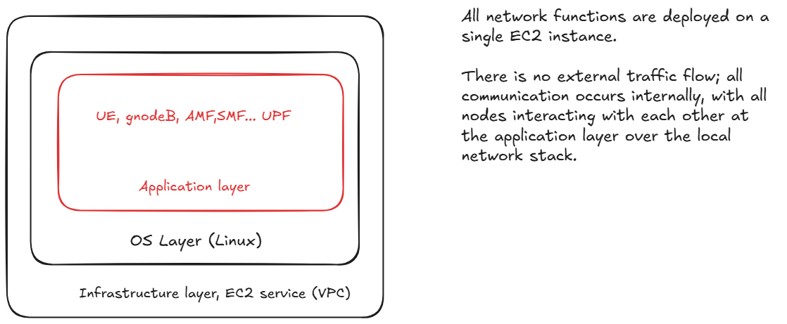
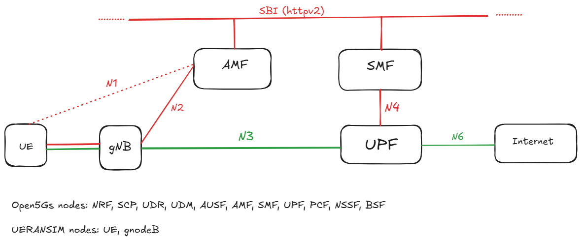
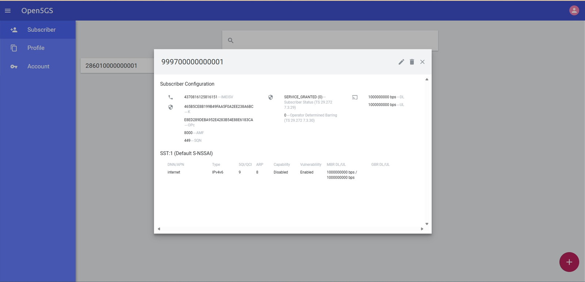
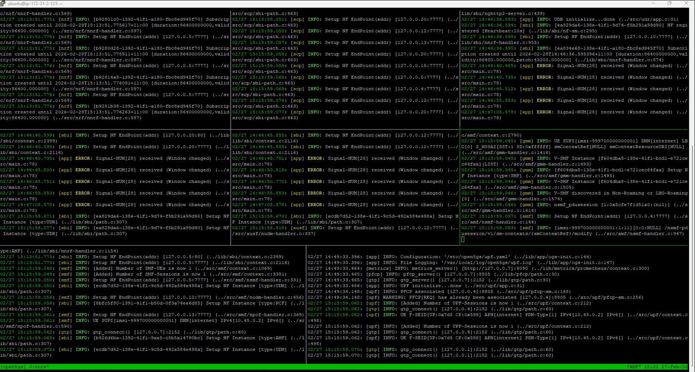
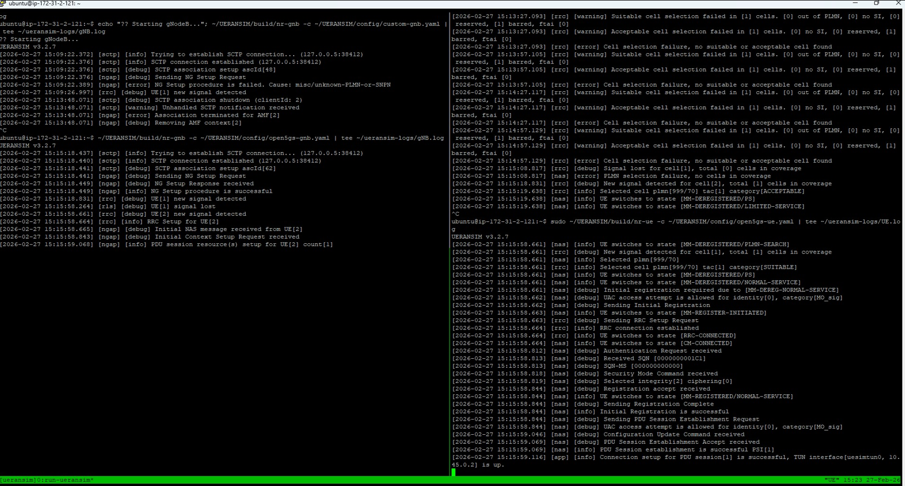

## Lab 1 – Open5GS + UERANSIM Implementation (Full Documentation)

~The pre‑configured AWS AMI for this lab is available to share. For details, see the About page.~

This section documents the complete workflow, scripts, commands, fixes, and troubleshooting steps performed during Lab 1. The goal was to deploy a full Open5GS 5G Core, launch UERANSIM gNodeB and UE, resolve registration and authentication issues, and validate user‑plane connectivity.

<figure markdown="span">
  { width="600" }
  <figcaption>AWS Application Structure</figcaption>
</figure>

<figure markdown="span">
  { width="600" }
  <figcaption>5G Architecture</figcaption>
</figure>

---

## 0. Handy scripts

-----> Install tshark (headless Wireshark)

```bash
sudo DEBIAN_FRONTEND=noninteractive apt update
sudo DEBIAN_FRONTEND=noninteractive apt install -y tshark
```

This installs the Wireshark engine without GUI.

-----> Export PCAPs for Wireshark\*\*
List:

```bash
ls -lh /tmp/*.pcap
```

Copy:

```bash
sudo cp /tmp/gnodeb_gtpu.pcap /home/ubuntu/
sudo cp /tmp/ue_traffic.pcap /home/ubuntu/
sudo cp /tmp/open5gs_full_capture.pcap /home/ubuntu/
```

Fix permissions:

```bash
sudo chown ubuntu:ubuntu /home/ubuntu/*.pcap
sudo chmod 644 /home/ubuntu/*.pcap
```

Download via SCP:

```bash
scp -i "your-key.pem" ubuntu@<EC2-IP>:/home/ubuntu/open5gs_full_capture
```

-----> Clean Open5GS logs\*\*

```bash
cd /var/local/log/open5gs
sudo truncate -s 0 *.log
```

-----> Capture ALL Open5GS traffic
This is useful for debugging SBI, PFCP, NGAP, GTP-U, everything.

```bash
sudo tshark -i any -w /tmp/open5gs_full_capture.pcap
```

Or in tmux:

```bash
tmux new -s open5gs_full_capture 'sudo tshark -i any -w /tmp/open5gs_full_capture.pcap'
```

-----> To change the time Zone

```bash
sudo timedatectl set-timezone Australia/Sydney
timedatectl
new -s open5gs_full_capture 'sudo tshark -i any -w /tmp/open5gs_full_capture.pcap'
```

----> How to check the health of DB?

```
cat << 'EOF' > check_mongodb_health.sh
#!/bin/bash
echo "?? Checking MongoDB service status..."
systemctl is-active mongod && echo "? mongod.service is active" || echo "? mongod.service is not active"

echo "?? Checking MongoDB port (27017)..."
ss -tuln | grep ':27017' && echo "? Port 27017 is listening" || echo "? Port 27017 is not listening"

echo "?? Running MongoDB ping via mongosh..."
mongosh "mongodb://127.0.0.1:27017" --quiet --eval 'db.runCommand({ ping: 1 })' | grep 'ok: 1' \
  && echo "? MongoDB responded to ping" || echo "? MongoDB ping failed"
EOF

chmod +x check_mongodb_health.sh
./check_mongodb_health.sh
```

-----> webui health check:

```
cat << 'EOF' > check_webui_health.sh
#!/bin/bash
WEBUI_PORT=9999
WEBUI_HOST=127.0.0.1

echo "?? Checking WebUI port ($WEBUI_PORT)..."
ss -tuln | grep ":$WEBUI_PORT" && echo "? WebUI port is listening" || echo "? WebUI port is not listening"

echo "?? Sending HTTP request to WebUI..."
STATUS_CODE=$(curl -s -o /dev/null -w "%{http_code}" http://$WEBUI_HOST:$WEBUI_PORT)

if [ "$STATUS_CODE" == "200" ]; then
  echo "? WebUI responded with HTTP 200"
else
  echo "? WebUI response code: $STATUS_CODE"
fi
EOF

chmod +x check_webui_health.sh
./check_webui_health.sh
```

<figure markdown="span">
  { width="600" }
  <figcaption>Open5Gs Portal</figcaption>
</figure>

## 1. Launching the Open5GS Core (8 NFs)

A tmux‑based launcher script was created to start all core NFs:

- NRF
- SCP
- UDR
- UDM
- AUSF
- AMF
- SMF
- UPF

### Core launcher script

```bash
cat <<'EOF' > ~/open5gs-lab.sh
#!/bin/bash
SESSION="open5gs"
LOG_DIR="$HOME/open5gs-logs"
mkdir -p "$LOG_DIR"

tmux kill-session -t "$SESSION" 2>/dev/null

nf_list=(
  "NRF" "SCP" "UDR" "UDM" "AUSF" "AMF" "SMF" "UPF"
)

declare -A nf_cmds=(
  ["NRF"]="/usr/local/bin/open5gs-nrfd"
  ["SCP"]="/usr/local/bin/open5gs-scpd"
  ["UDR"]="/usr/local/bin/open5gs-udrd"
  ["UDM"]="/usr/local/bin/open5gs-udmd"
  ["AUSF"]="/usr/local/bin/open5gs-ausfd"
  ["AMF"]="/usr/local/bin/open5gs-amfd"
  ["SMF"]="/usr/local/bin/open5gs-smfd"
  ["UPF"]="/usr/local/bin/open5gs-upfd"
)

first=true
split="-v"
for nf in "${nf_list[@]}"; do
  CMD="echo Starting $nf && (${nf_cmds[$nf]} | tee $LOG_DIR/$nf.log || echo '$nf failed')"

  if $first; then
    tmux new-session -d -s "$SESSION" -n core "$CMD"
    tmux select-pane -T "$nf"
    first=false
  else
    tmux split-window $split -t "$SESSION"
    tmux select-pane -T "$nf"
    tmux send-keys -t "$SESSION" "$CMD" C-m
    tmux select-layout -t "$SESSION" tiled
    [ "$split" = "-v" ] && split="-h" || split="-v"
  fi

  sleep 5
done

tmux select-layout -t "$SESSION" tiled
tmux attach-session -t "$SESSION"
EOF

chmod +x ~/open5gs-lab.sh
~/open5gs-lab.sh
```

<figure markdown="span">
  { width="600" }
  <figcaption>Live 5G Core troubleshooting environment with parallel NF logs for deep‑dive analysis</figcaption>
</figure>

## 2. Fixing UPF Capabilities

UPF initially failed due to missing capabilities.

Fix:
sudo setcap cap_net_admin=eip /usr/local/bin/open5gs-upfd

### UPF launcher script

```
cat <<'EOF' > ~/launch-upf.sh
#!/bin/bash

echo "Launching UPF..."
mkdir -p ~/open5gs-logs

/usr/local/bin/open5gs-upfd -c /etc/open5gs/upf.yaml | tee ~/open5gs-logs/UPF.log &

sleep 3

if ip addr show ogstun > /dev/null 2>&1; then
echo "UPF launched successfully. ogstun interface is up."
else
echo "UPF may have failed. ogstun interface not found."
echo "Check logs at ~/open5gs-logs/UPF.log"
fi
EOF

chmod +x ~/launch-upf.sh
~/launch-upf.sh
```

To show latest logs:

tail -f /var/local/log/open5gs/upf.log

## 3. Launching PCF, NSSF, and BSF

```
nano ~/launch-open5gs.sh

cat <<'EOF' > ~/launch-open5gs.sh
#!/bin/bash

LOGDIR=~/open5gs-logs
mkdir -p "$LOGDIR"

echo "Launching Open5GS NFs..."

echo "PCF..."
/usr/local/bin/open5gs-pcfd -c /etc/open5gs/pcf.yaml | tee "$LOGDIR/PCF.log" &
sleep 2

echo "NSSF..."
/usr/local/bin/open5gs-nssfd -c /etc/open5gs/nssf.yaml | tee "$LOGDIR/NSSF.log" &
sleep 2

echo "BSF..."
/usr/local/bin/open5gs-bsfd -c /etc/open5gs/bsf.yaml | tee "$LOGDIR/BSF.log" &
sleep 2

echo "All NFs launched. Logs are in $LOGDIR"
EOF

chmod +x ~/launch-open5gs.sh

bash ~/launch-open5gs.sh

sudo mkdir -p /var/local/log/open5gs
sudo touch /var/local/log/open5gs/pcf.log
sudo chown -R $(whoami) /var/local/log/open5gs

/usr/local/bin/open5gs-pcfd -c /etc/open5gs/pcf.yaml | tee ~/open5gs-logs/PCF.log
```

## 4. Launch UERANSIM (gNodeB + UE)

```
nano ~/tmux-ueransim.sh

cat <<'EOF' > ~/tmux-ueransim.sh
#!/bin/bash

SESSION="ueransim"
LOGDIR=~/ueransim-logs
mkdir -p "$LOGDIR"

tmux new-session -d -s $SESSION -n run-ueransim

tmux send-keys -t $SESSION:0.0 'echo "Starting gNodeB..."; ~/UERANSIM/build/nr-gnb -c ~/UERANSIM/config/custom-gnb.yaml | tee ~/ueransim-logs/gNB.log' C-m

tmux split-window -h -t $SESSION:0
tmux send-keys -t $SESSION:0.1 'sleep 5; echo "Starting UE..."; ~/UERANSIM/build/nr-ue -c ~/UERANSIM/config/custom-ue.yaml | tee ~/ueransim-logs/UE.log' C-m

tmux select-pane -t $SESSION:0.0 -T "gNodeB"
tmux select-pane -t $SESSION:0.1 -T "UE"

tmux attach-session -t $SESSION
EOF

chmod +x ~/tmux-ueransim.sh

bash ~/tmux-ueransim.sh
```

## 5. gNodeB Configuration Fixes

```
nano ~/UERANSIM/config/custom-gnb.yaml

Changing the gNB PLMN to 99970
mcc: 999
mnc: 70

comment out the sd parameter
# sd: 0

Restart gNodeB
~/UERANSIM/build/nr-gnb -c ~/UERANSIM/config/custom-gnb.yaml | tee ~/ueransim-logs/gNB.log
```

## 6. UE Configuration Fixes

```
nano ~/UERANSIM/config/custom-ue.yaml

Update IMSI
Match the subscriber entry in Open5GS WebUI.

Fix authentication
opType: 'OPC'

Fix registration reject cause 62
# sd: 1

Restart UE
~/UERANSIM/build/nr-ue -c ~/UERANSIM/config/custom-ue.yaml

Fix TUN creation failure
sudo ~/UERANSIM/build/nr-ue -c ~/UERANSIM/config/custom-ue.yaml
```

<figure markdown="span">
  { width="600" }
  <figcaption>5G attach and PDU establishment</figcaption>
</figure>

## 7. Monitor Logs

```
sudo tail -F /var/local/log/open5gs/amf.log
sudo tail -F /var/local/log/open5gs/smf.log
sudo tail -F /var/local/log/open5gs/udm.log
sudo tail -F /var/local/log/open5gs/udr.log
sudo tail -F /var/local/log/open5gs/upf.log
tail -F ~/ueransim-logs/gNB.log
```
